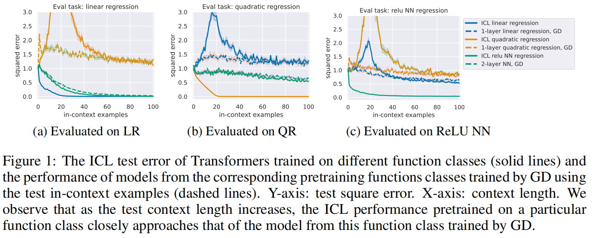

## 📕Introduction

This is the official implementation of ICLR 2025 paper "Can In-context Learning Really Generalize to Out-of-distribution Tasks?"

<p>
  <a href="https://openreview.net/pdf?id=INe4otjryz">
    
  </a>



## ⭐Takeaways of this paper

* **Given an OOD context, ICL finds a near-optimal solution within its pretraining task space. Particularly, when learning OOD mathematical functions, ICL behaves as a predictor of its pretraining function class optimized by GD using the in-context examples.**
* **The capability to handle abstract label classification does not represent a true OOD generalization capability. Instead, it's a process of in-distribution prediction and retrieval.**
* **When faced with an OOD task, ICL operates by identifying the most suitable pretraining meta-distribution based on test error and input distribution discrepancies, and then attempts to find an optimal solution within that meta-distribution.**


## ⚙Setup

```bash
conda env create -f environment.yml
conda activate in-context-learning
```

## Directly reproduce the experiments

### Reproduce Fig. 1,3,4,5,7 (GPT-2 experiments)

Please see `eval_multi_curve.ipynb`.

### Reproduce Fig. 8 (Numerical experiments for the theory)

Please see `run.sh` in `./src/exp_for_theory`

### Reproduce Fig. 2,6,9 (LLM experiments)

Coming soon.


## 🔥Train and evaluate your own model

### Training

```bash
cd ./src
conda activate in-context-learning
python train.py --config conf/linear_regression.yaml
```

The trained model weights will be saved to `./results/trained_ckpt_and_eval_results/`. Note that we didn't upload the trained checkpoints in this direction.

### Evaluation

```bash
python -m eval_ood_task --pretrain_path ./results/trained_ckpt_and_eval_results/linear_regression/[random-id-generated-by-your-system] \
    --ood_task quadratic_regression --device cuda:5 --n_context_test 101
```

The raw evaluation results are saved in `./results/trained_ckpt_and_eval_results/` for displaying in `./src/eval_multi_curve.py`. Each folder corresponds to a pretraining task, and the evaluation results of different evaluation tasks are together recorded in `metrics.json` under each folder.


## 🔧Other details

We also maintain the raw evaluation results of some other function classes in `./results/trained_ckpt_and_eval_results/`. We didn't include these results in our paper to avoid making the paper too lengthy, nevertheless, we find some of them interesting. You can simply identify the pretraining task by observing the path name to get the corresponding result and display it by adding it in `./src/eval_multi_curve.py`.


## Cite this paper

Welcome to cite our work if you find it insightful.

``` 
@inproceedings{
wang2025can,
title={Can In-context Learning Really Generalize to Out-of-distribution Tasks?},
author={Qixun Wang and Yifei Wang and Xianghua Ying and Yisen Wang},
booktitle={The Thirteenth International Conference on Learning Representations},
year={2025},
url={https://openreview.net/forum?id=INe4otjryz}
}
```


{Can In-context Learning Really Generalize to Out-of-distribution Tasks?},
  author={Wang, Qixun and Wang, Yifei and Ying, Xianghua and Wang, Yisen},
  booktitle={ICLR},
  year={2025}
}
</pre></code>